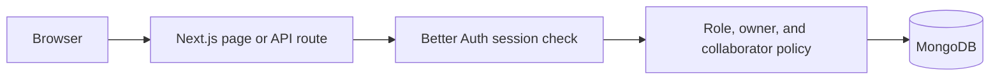
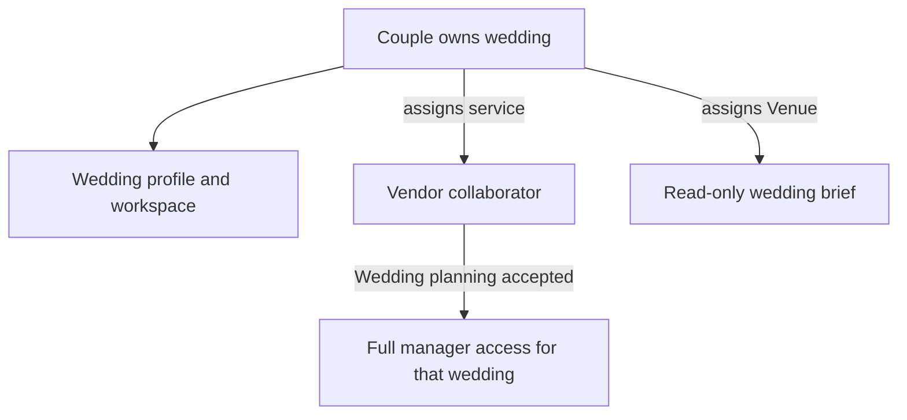

# Architecture diagrams

Diagrams should describe current behavior separately from proposals. Keep source formats (for example Mermaid) in this directory so changes can be reviewed as text.

## Current request path

## Current wedding access

Update the diagrams when the domain or authorization model changes. The organisation and subscription diagrams remain future work until those records exist.
